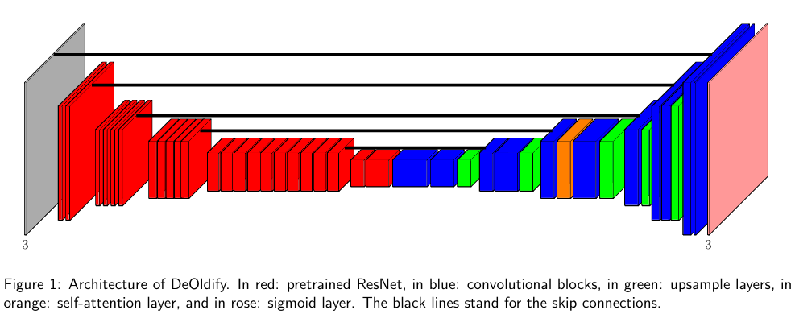

# TempleVision:
## Introduction : 
- This project is the Final Year project of Bachelor in Information Technology, which i made during my 5th semester,This project uses DeOldify Generator model made by jason antic, this model has the best performance in the photo colorization field . Now, after carefully reading, the model architecture and it's training notebook, i was able to finetune the model on the image of data of temples from my hometown kathmandu which is a capital city of country Nepal. The data is both collected personally primary data and webscraped from the internet secondary data. The since only 2500 image of data i was able to collect the performance is not that great but it sure outperforms the pre-trained model. we use different evaluation metrices like:MSE,PSNR,SSIM. 

# Generative Adversarial Network (GAN)

## Terms
- **Gen**: Generator
- **Disc**: Discriminator
- **Z**: Latent Space Representation

## Methodology
- 3k images are generally used.
- The 'Gen' is run once and the 'Disc' is run twice. Literature suggests that running the 'Disc' more times than the 'Gen' yields state-of-the-art performance.
- The 'Disc' tries to maximize its loss, whereas the 'Gen' tries to minimize its loss.
- The generator uses an Encoder-Decoder architecture:
  - The generator takes a grayscale image and generates a latent representation 'Z'.
  - The decoder's job is to produce a colorful image by enlarging the "Z".

## U-Net Architecture
- Used to segment objects from images.
- The images contain objects such as temples, people, birds, flags, etc.
- Designed for semantic segmentation.
- Two kinds of segmentation:
  - Instance
  - Semantic

## DeOldify Model

[Understanding GANs with DeOldify](https://medium.com/@rohanricky/understanding-gans-with-deoldify-ddaccd684daf)

### Variants
- **Artistic**: Focused on colorful colorizations rather than spatial stability.
- **Video**: Focused on spatial and temporal stability.
- **Stable**: Focused only on spatial stability, yielding more colorful colorizations than the 'video' version but less than the 'artistic' version.

### Network Architecture

- It uses a U-net Architecture
- U-Net architecture is used for the colorizer network.
- The U-Net architecture encoding part is made from pre-trained ResNet because:
  - It provides strong feature extraction and compact abstract representation.
  - The Artistic Color Variant model specially use resNet34 while others use resNet101 , due to computational capacity
- The U-Net architecture decoding part uses the abstract representation from encoder resNet34 
    - to reconstruct the final output image. It applies up-sampling and convolution operations to gradually rebuild the image, adding color information and refining details to produce a colorized version
- As we can see the:
    - Red part in architecture is : ResNet34
    - Blue part is Convolution layer
    - Green part is Upsampling layer
    - Orange part is self-attention layer
    - at Last pink is sigmoid layer
    - the black lines are skip connectuin which are commin in U-Net architecture.
## Training Phases:

  - Initial Training: The model "ArtisticModel" is trained from scratch starting with an image size of 64x64.
    - Progressive Training: The model is then incrementally trained with larger image sizes of 128x128 and 192x192. Each phase involves saving the model and then loading it for the next training phase.
  - Evaluation:

    - Generate Images: After training with the largest image size, the generator model is used to generate images to evaluate its performance.
  - GAN Technique:

    - Simultaneous Training: The GAN technique is employed where both the generator and critic models are trained simultaneously. The generator creates images, while the critic evaluates them, and both models are adjusted based on their interactions.
  - Final Fine-Tuning:

    - Checkpoint Selection: The best checkpoint (with fewer glitches) is selected based on its performance.
    - Fine-Tuning: This checkpoint model is then fine-tuned by freezing all layers except for the last one. This ensures that the model's existing knowledge is preserved while focusing on fine-tuning the last layer for further improvements.